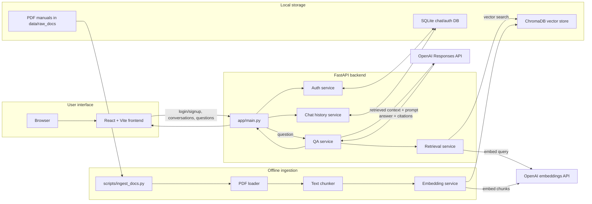

Tech Fault RAG Chatbot

A Retrieval-Augmented Generation (RAG) chatbot designed to answer technical queries by combining vector search with large language models. The backend is built with FastAPI, and the UI now has a minimal React frontend that talks to the existing `/ask` API.

Architecture



Features
Semantic Search using vector embeddings
RAG Pipeline (Retrieve -> Augment -> Generate)
Document Ingestion (PDFs, text, etc.)
Retrieval with ChromaDB
Context-Aware Responses with citations
Minimal React UI for asking questions and viewing retrieved chunks

Tech Stack
Language: Python, JavaScript
Backend: FastAPI
Frontend: React + Vite
Vector DB: ChromaDB
Embeddings: OpenAI / Sentence Transformers
LLM: OpenAI GPT
Environment: Python 3.14+, Node.js 18+

Backend setup

1. Create a `.env` file with your `OPENAI_API_KEY`.
2. Optional: set `FRONTEND_ORIGINS` to a comma-separated list of allowed browser origins. By default, the backend allows `http://localhost:5173` and `http://127.0.0.1:5173`.
3. Start the API:

```bash
uv run uvicorn app.main:app --reload
```

Frontend setup

1. Move into the frontend app:

```bash
cd frontend
```

2. Install dependencies:

```bash
npm install
```

3. Optional: create a frontend env file if your API is running somewhere else:

```bash
cp .env.example .env
```

4. Start the React app:

```bash
npm run dev
```

The frontend defaults to `http://127.0.0.1:8000` for API calls, which matches the local FastAPI server above.
