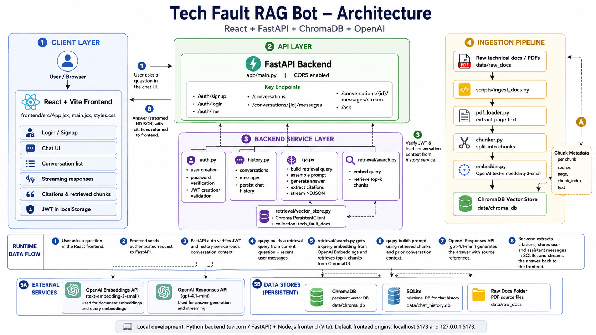

# Tech Fault RAG Chatbot

A Retrieval-Augmented Generation (RAG) chatbot for answering technical troubleshooting queries. Built with FastAPI + ChromaDB + OpenAI, with a React streaming UI and per-user conversation history.

## Architecture



```
User → React UI (Vite)
         ↓ HTTPS / streaming NDJSON
      FastAPI backend
         ├── Auth (HMAC-SHA256 JWT, SQLite users)
         ├── Conversation history (SQLite)
         └── RAG pipeline
               ├── Query embedding (text-embedding-3-small)
               ├── Vector search (ChromaDB)
               └── Answer generation (gpt-4.1-mini, streaming)
```

## Features

- Semantic vector search over your own PDF documents
- Streaming answers with inline `[Source N]` citations
- Per-user conversation history (multi-user, auth-gated)
- Context-aware follow-up questions using recent conversation history
- Sentence-aware chunking with overlap to preserve context across chunk boundaries

## Quick start

### Backend

1. Copy `.env.example` (or create `.env`) and add your key:

```env
OPENAI_API_KEY=sk-...
AUTH_SECRET_KEY=your-random-secret-here
```

2. Drop PDF documents into `data/raw_docs/` and ingest them:

```bash
uv run python scripts/ingest_docs.py
```

3. Start the API:

```bash
uv run uvicorn app.main:app --reload
```

### Frontend

```bash
cd frontend
npm install
npm run dev
```

The frontend defaults to `http://127.0.0.1:8000` for API calls.

### Docker (full stack)

```bash
docker compose up --build
```

API at `http://localhost:8000`, UI at `http://localhost:3000`.

## Environment variables

| Variable | Default | Description |
|---|---|---|
| `OPENAI_API_KEY` | — | Required. Your OpenAI API key. |
| `AUTH_SECRET_KEY` | `dev-insecure-auth-secret` | **Change before deploying.** Signs JWTs. |
| `LLM_MODEL` | `gpt-4.1-mini` | OpenAI model used for answer generation. |
| `FRONTEND_ORIGINS` | `http://localhost:5173` | Comma-separated CORS allowed origins. |
| `ACCESS_TOKEN_EXPIRE_SECONDS` | `604800` (7 days) | JWT lifetime. |

## Running tests

```bash
uv run pytest tests/ -v
```

Tests cover the chunker, auth primitives (hashing, JWT sign/verify), and all RAG builder functions. No external services are required.

## Offline evaluation

Once you have a populated vector DB, you can measure retrieval quality:

```bash
uv run python scripts/eval.py
```

Outputs per-question citation count, keyword coverage score, and an aggregate summary.

## Design decisions

**ChromaDB over Pinecone/Weaviate** — runs fully locally with zero infra setup. For a portfolio project this means anyone can clone the repo and run it in minutes. The vector store is rebuild-able from source PDFs via `scripts/ingest_docs.py`.

**Hand-rolled HMAC-SHA256 JWT** — demonstrates understanding of the underlying mechanism (base64url encoding, signing input, constant-time comparison). The primitives are all from the standard library. In a production service I'd swap to `python-jose` to reduce surface area.

**Sentence-aware chunking with overlap** — splits on sentence boundaries (`.!?` followed by a capital letter) rather than fixed character windows, so chunks don't cut mid-sentence. A 40-token overlap between adjacent chunks preserves context across boundaries.

**Synchronous FastAPI routes** — the OpenAI SDK calls block a worker thread. This is fine for a single-user demo; switching to `AsyncOpenAI` + `async def` routes would be the right next step before putting this behind real load.

**Stateless JWT, client-side logout** — tokens expire after 7 days by default. There is no server-side revocation list, so logout is purely client-side (token deleted from `localStorage`). Acceptable for a demo; production would want short-lived access tokens + refresh tokens.

**Inactivity auto-logout** — the frontend tracks mouse/keyboard/scroll events and logs the user out after 30 minutes of inactivity (configurable via `VITE_INACTIVITY_TIMEOUT_MINUTES`).

## Project structure

```
app/
  config.py          — all env-driven config in one place
  main.py            — FastAPI routes
  services/
    auth.py          — JWT creation/validation, password hashing, rate limiting
    qa.py            — RAG pipeline (context building, prompt assembly, citation parsing)
    history.py       — conversation and message CRUD (SQLite)
  ingestion/
    pdf_loader.py    — PDF → page records (pypdf)
    chunker.py       — sentence-aware token-budget chunking
    embedder.py      — batch embedding via OpenAI API
  retrieval/
    vector_store.py  — ChromaDB client
    search.py        — embed query + vector search
scripts/
  ingest_docs.py     — load PDFs → chunk → embed → upsert into ChromaDB
  eval.py            — offline retrieval quality evaluation
  test_qa.py         — manual integration smoke test
  test_search.py     — manual search smoke test
tests/               — pytest unit tests (no external deps required)
frontend/src/
  App.jsx            — top-level orchestration
  hooks/             — useAuth, useConversations, useChatStream
  components/        — AuthScreen, Sidebar, MessageThread, Composer
  lib/               — api utilities, display helpers
```

## License

MIT — see [LICENSE](LICENSE).
